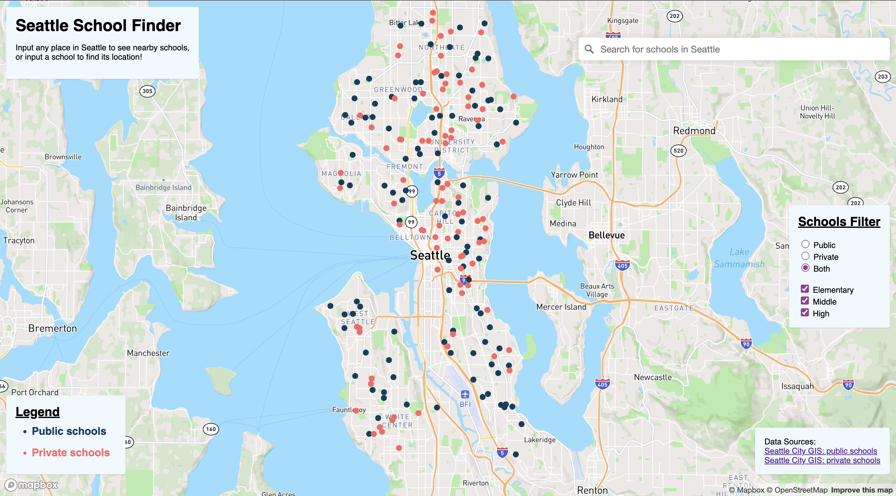
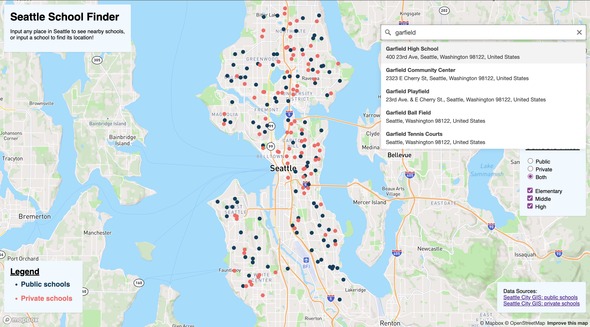
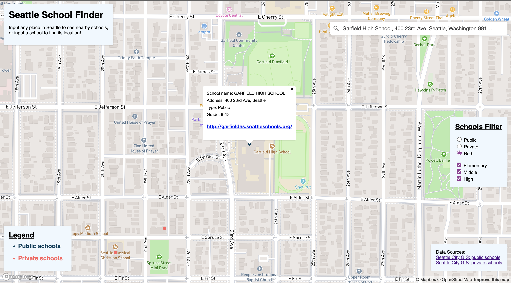

# Seattle School Finder

## Description
Our project, entitled Seattle School Finder, is an interactive web map depicting the locations of all elementary, middle, and high schools in Seattle. Each school is represented with either a blue dot (if it is a public school) or pink dot (if it is a private school). Upon clicking on one of the dots, an information panel will appear listing the school’s name, address, type (public or private) grades served, and website. The map uses the Geocoding API to allow users to search for any address in the city of Seattle to easily visualize which schools are nearby, or search for a school directly to locate it on the map. The toggle function allows users to remove dots for schools that are irrelevant to the user.

## Goal
The goal of the project is to provide a resource for parents looking into the various options of schools in Seattle to enroll their children in. As parents will likely take a number of different factors into account when choosing a school, we designed our map with the intention of accommodating a wide variety of potential considerations. Those planning on moving to Seattle can search for their neighborhood or workplace to see what schools are nearby. Alternatively, users can search for a school to see its location on the map with respect to other points of interest. Once a school is located, the user can click on the dot to see more relevant information, including a link to the school’s website for the user to get more information about the school to decide if it’s the right choice for their children. Because there are hundreds of schools in the city, the differently colored public and private schools as well as the toggle features on the right hand side are designed to help parents restrict the schools that appear on the map to ones that fit their needs.

## URL
[Seattle Schools Map](https://phammy22.github.io/geog495_bb1/)

## Screenshots

## Main Functions
One of the main functions of this application is the search bar. Since the Geocoding API can return a variety of places that may be relevant to picking a school, users can utilize the search bar according to their needs. The search results will only return localized data, which will prevent the user from seeing irrelevant results. For example, a family that just bought a house in Seattle can search for the address of their house to find what schools are nearby. Similarly, a parent planning on driving their child to or from school may be interested to know what schools are in close proximity to their workplaces. If the user already has a school in mind and wants to know what other amenities are in the area, they can search for the school to see nearby businesses and restaurants that students can patronize or find an after school job at, study or hangout spots such as libraries or coffee shops, gyms, light rail stations, or any other places that may be of interest to them. Seeing the school in consideration marked on the basemap can also help users visualize a commute between their home and/or office and the school. 

Another key function is the toggle panel on the right hand side of the page. We identified public versus private schools and the grade level(s) of the users’ children to be the two most immediately important criteria for parents to consider when choosing a school for their children, so we designed the toggle bar to narrow down the schools being shown to only those that fit these two most critical criteria. Most users would probably already know if they want to choose a public or private school, and can select the toggle settings accordingly. For those still deciding, there is the option to view both on the map at once. Though filtering by school level would be a useful function for many users, we anticipate that some users may not wish to restrict their search to a single school level. Many schools, particularly private schools, may serve varying grade levels, and some parents have multiple children of various ages that they need to find schools for. To accommodate these issues, we made it possible to choose more than one option out of elementary, middle, and high schools. 

## Data source
The raw data was taken from publicly available feature layer data released by the Seattle City GIS Program, which provided the coordinates, names, grade levels, websites, and other information about the schools on our map. We used two datasets: [Public Schools]( https://data-seattlecitygis.opendata.arcgis.com/datasets/SeattleCityGIS::public-schools/explore?location=47.595213%2C-122.272143%2C10.86) and [Private Schools](https://data-seattlecitygis.opendata.arcgis.com/datasets/SeattleCityGIS::private-schools-1/explore?location=47.610266%2C-122.312178%2C11.00), which were both last updated March 23, 2022.

## Applied Libraries
We used the javascript library Mapbox GL JS and used GitHub for version control.

## Acknowledgements
We would like to thank Professor Zhao, our TA Steven Bao, and our classmates in Geog 495 for helping us develop the skills we used for this project!
